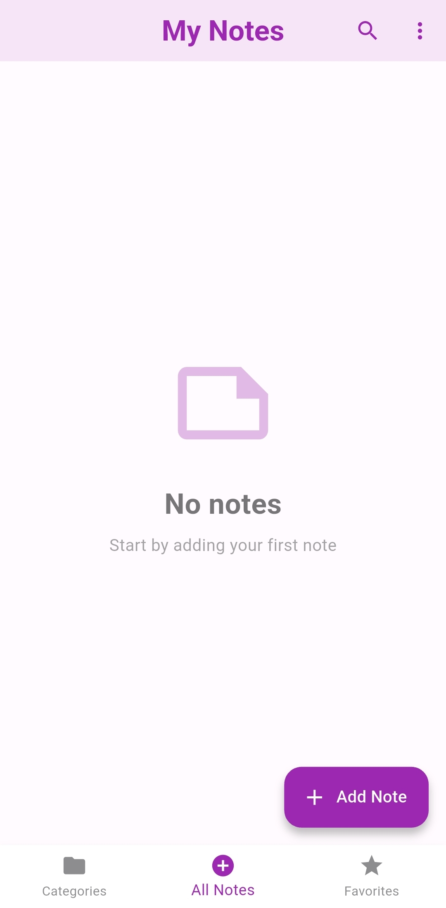
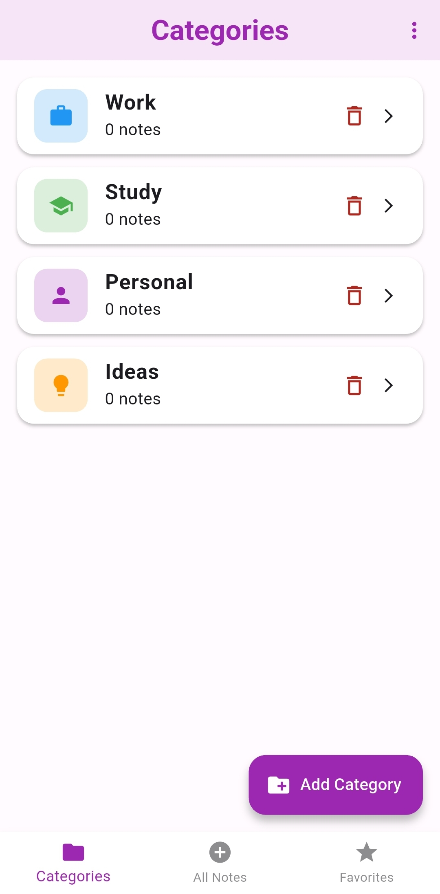
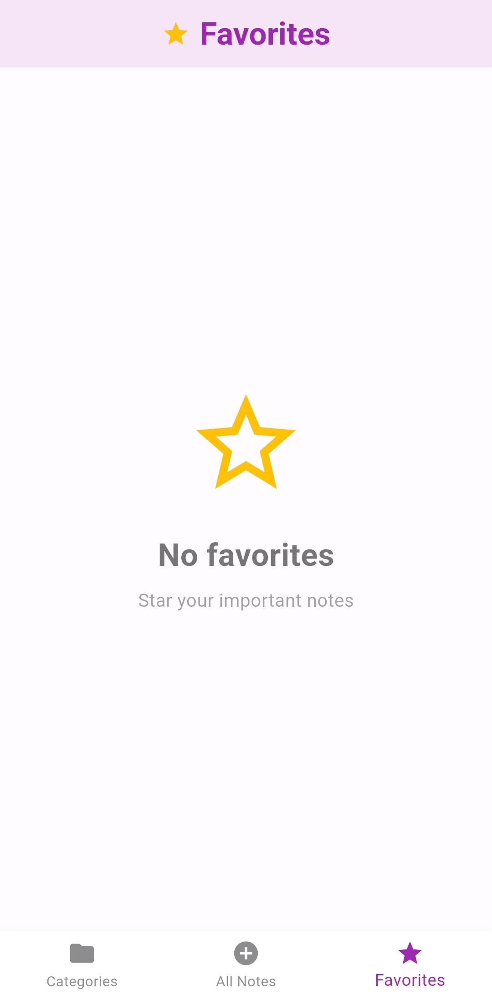
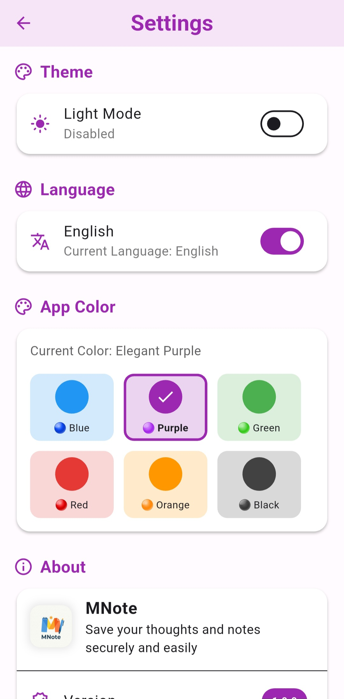

# 📝 MNote - Simple Notes Application

<div align="center">
  

[](https://flutter.dev/)
[](https://dart.dev/)
[](LICENSE)

**Save your thoughts and notes securely and easily**

[Features](#features) • [Screenshots](#screenshots) • [Installation](#installation) • [Technologies](#technologies)
</div>

---

## 🌟 Features

### Core Features
- 📱 **Quick Save** - Save your ideas quickly and easily
- 🎨 **Colored Categories** - Organize notes in colored groups with custom icons
- ⭐ **Favorites** - Star important notes for quick access
- 🔍 **Fast Search** - Find any note instantly
- 🌙 **Dark Mode** - Use comfortably day or night
- 🌍 **Bilingual** - Full support for Arabic and English

### Advanced Features
- 🗂️ **Smart Organization** - Category system with color-coded icons
- 🎨 **Theme Customization** - 6 color schemes to choose from
- 📊 **Multi-Select** - Batch delete multiple notes
- 🔄 **Auto Sync** - Real-time synchronization between screens
- 💾 **Offline Storage** - All data stored locally and securely
- 🏷️ **Category Tags** - See category labels on each note

---

## 📱 Screenshots

<div align="center">
  
  
  
  
</div>

---

## 🛠️ Technologies Used

### Framework & Language
- **Flutter 3.10.4+** - Cross-platform UI framework
- **Dart 3.0+** - Programming language

### State Management
- **Provider 6.1.1** - State management solution

### Local Storage
- **Sqflite 2.3.0** - SQLite database
- **SharedPreferences 2.2.2** - Key-value storage
- **Path Provider 2.1.1** - File system paths

### UI & Animations
- **Google Fonts 6.1.0** - Cairo font family
- **Flutter Staggered Animations 1.1.1** - List animations
- **Material Design 3** - Modern UI design

### Localization
- **Flutter Localizations** - Arabic & English support
- **Intl 0.20.2** - Date formatting

---

## 📋 Requirements

- Flutter SDK: `>=3.10.4`
- Dart SDK: `>=3.0.0`
- Android Studio / VS Code
- Android SDK (for Android build)
- Git

---

## 🚀 Installation

### 1. Clone the Repository
```bash
git clone https://github.com/m7moudbh/mnote_app.git
cd mnote_app
```

### 2. Install Dependencies
```bash
flutter pub get
```

### 3. Generate App Icon (Optional)
```bash
flutter pub run flutter_launcher_icons
```

### 4. Run the App
```bash
flutter run
```

---

## 📂 Project Structure
```
mnote_app/
├── lib/
│   ├── models/              # Data models
│   │   ├── note_model.dart
│   │   └── category_model.dart
│   ├── screens/             # UI screens
│   │   ├── splash_screen.dart
│   │   ├── main_screen.dart
│   │   ├── all_notes_screen.dart
│   │   ├── categories_screen.dart
│   │   ├── favorites_screen.dart
│   │   ├── category_notes_screen.dart
│   │   ├── add_edit_note_screen.dart
│   │   └── settings_screen.dart
│   ├── services/            # Business logic
│   │   ├── local_storage_service.dart
│   │   ├── theme_provider.dart
│   │   ├── locale_provider.dart
│   │   └── color_provider.dart
│   ├── widgets/             # Reusable widgets
│   │   └── note_tile.dart
│   ├── utils/               # Utilities
│   │   ├── constants.dart
│   │   └── app_localizations.dart
│   └── main.dart            # App entry point
├── assets/
│   ├── icon/                # App icon
│   ├── images/              # Images
│   └── fonts/               # Cairo font
├── android/                 # Android configuration
├── pubspec.yaml            # Dependencies
└── README.md               # This file
```

---

## 🗄️ Database Schema

### Notes Table
| Column | Type | Description |
|--------|------|-------------|
| id | INTEGER | Primary key |
| title | TEXT | Note title |
| content | TEXT | Note content |
| createdDate | TEXT | ISO date string |
| categoryId | INTEGER | Foreign key (nullable) |
| isFavorite | INTEGER | Boolean (0 or 1) |

### Categories Table
| Column | Type | Description |
|--------|------|-------------|
| id | INTEGER | Primary key |
| name | TEXT | Category name |
| icon | TEXT | Icon name |
| color | TEXT | Color hex string |
| createdDate | TEXT | ISO date string |
| translationKey | TEXT | i18n key (nullable) |

---

## 🎨 Color Themes

The app includes 6 beautiful color themes:
- 🔵 **Blue** - Default (#2196F3)
- 🟣 **Purple** - (#9C27B0)
- 🟢 **Green** - (#4CAF50)
- 🔴 **Red** - (#E53935)
- 🟠 **Orange** - (#FF9800)
- ⚫ **Black** - (#424242)

---

## 🌐 Localization

Supported languages:
- 🇸🇦 **Arabic** - Right-to-left (RTL)
- 🇬🇧 **English** - Left-to-right (LTR)

All UI elements, including default categories, are fully translated.

---

## 🔧 Build Commands

### Development Build
```bash
flutter run
```

### Release Build (Android)
```bash
flutter build apk --release
```

### Debug APK
```bash
flutter build apk --debug
```

### App Bundle (for Google Play)
```bash
flutter build appbundle --release
```

---

## 📦 Version History

### Version 1.0.0 (Current)
- ✅ Core note-taking functionality
- ✅ Category system with colored icons
- ✅ Favorites system
- ✅ Multi-select and batch delete
- ✅ Dark/Light theme
- ✅ Arabic/English localization
- ✅ 6 color themes
- ✅ Auto-sync between screens
- ✅ Offline storage

---

## 🤝 Contributing

Contributions are welcome! Please follow these steps:

1. Fork the repository
2. Create a feature branch (`git checkout -b feature/AmazingFeature`)
3. Commit your changes (`git commit -m 'Add some AmazingFeature'`)
4. Push to the branch (`git push origin feature/AmazingFeature`)
5. Open a Pull Request

---

## 📝 License

This project is licensed under the MIT License - see the [LICENSE](LICENSE) file for details.

---

## 👨‍💻 Author

**Mahmoud**
- Developer & Designer
- Contact: [mahmoudebanihani@gmail.com]

---

## 🙏 Acknowledgments

- Flutter team for the amazing framework
- Material Design for UI guidelines
- Community contributors and testers

---

## 📞 Support

If you have any questions or need help:
- 📧 Email: [mahmoudebanihani@gmail.com]
- 🐛 Issues: [GitHub Issues](https://github.com/m7moudbh/mnote_app/issues)

---

<div align="center">
  Made with ❤️ using Flutter

⭐ Star this repo if you like it!
</div>